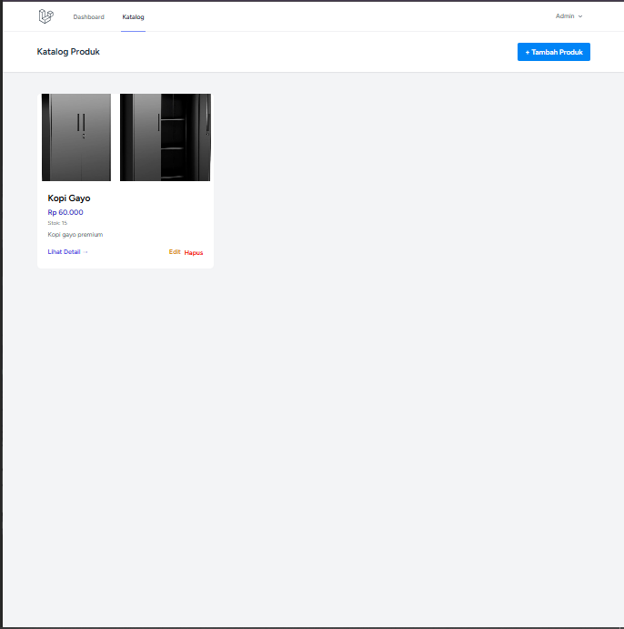
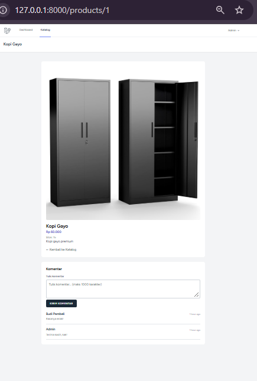
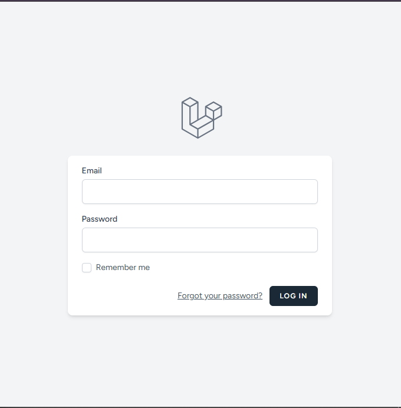
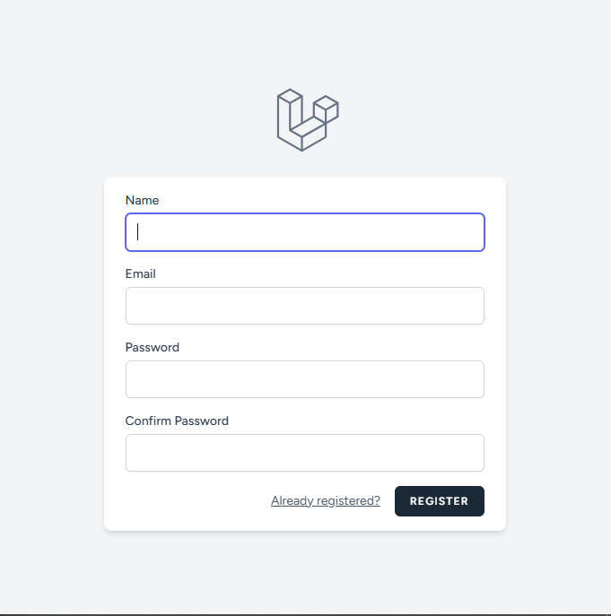
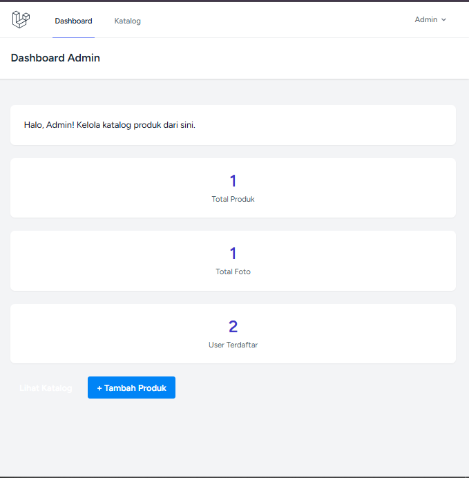
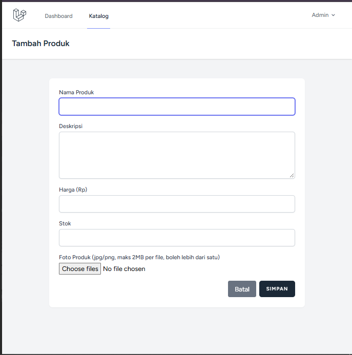
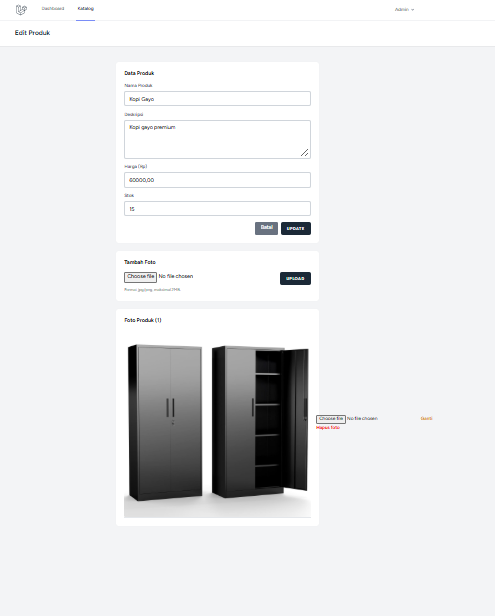

# Web Katalog Produk — UKK

Aplikasi web katalog produk client-server untuk PT Indonesia Solusindo (studi kasus Icha & Ahnaf).
Pembeli (user) melihat katalog produk, foto, dan memberi komentar; admin mengelola produk beserta fotonya.

## Tech Stack

- Backend: Laravel 13 (PHP 8.3)
- Database: MySQL (`db_katalog_produk`)
- Frontend: Blade + Tailwind CSS (konsisten di semua halaman, bawaan Laravel Breeze)
- Auth: Laravel Breeze (dikustom role `admin` / `user`)
- Struktur folder: default Laravel (MVC)

## Role & Hak Akses

| Fitur              | User | Admin |
| ------------------ | :--: | :---: |
| Login              |  ✔   |   ✔   |
| Logout             |  ✔   |   ✔   |
| Register           |  ✔   |   ✘   |
| Lihat Foto Produk  |  ✔   |   ✔   |
| Tambah Foto Produk |  ✘   |   ✔   |
| Edit Foto Produk   |  ✘   |   ✔   |
| Hapus Foto Produk  |  ✘   |   ✔   |
| Tambah Komentar    |  ✔   |   ✔   |

Admin tidak bisa register — akun admin dibuat lewat seeder.

## Cara Install & Run

Prasyarat: PHP 8.2+, Composer, MySQL berjalan.

```sh
cd lat-ukk
composer install
cp .env.example .env        # Windows: copy .env.example .env
php artisan key:generate
```

Buat database MySQL kosong `db_katalog_produk`, lalu sesuaikan `.env`:

```ini
DB_CONNECTION=mysql
DB_HOST=127.0.0.1
DB_PORT=3306
DB_DATABASE=db_katalog_produk
DB_USERNAME=root
DB_PASSWORD=
```

```sh
php artisan migrate --seed   # membuat tabel + akun admin default
php artisan storage:link     # symlink public/storage untuk foto produk
php artisan serve            # http://localhost:8000
```

> `.env` tidak di-commit (sudah di `.gitignore`). Kredensial tidak di-hardcode.

## Akun Default (testing)

| Role  | Email                  | Password |
| ----- | ---------------------- | -------- |
| Admin | `admin@solusindo.com`  | `admin123` |
| User  | register lewat `/register` (otomatis role `user`) | — |

## Daftar Route / Fitur

| Method | URI | Nama | Akses |
| ------ | --- | ---- | ----- |
| GET | `/` | — | Publik (redirect ke katalog) |
| GET | `/products` | `products.index` | Publik (katalog + grid responsif) |
| GET | `/products/{product}` | `products.show` | Publik (detail + foto + komentar) |
| GET/POST | `/register` | `register` | Guest (role dikunci `user` di server) |
| GET/POST | `/login` | `login` | Guest (admin → dashboard, user → `/`) |
| POST | `/logout` | `logout` | Auth |
| GET | `/dashboard` | `dashboard` | Admin (statistik + aksi cepat) |
| GET/POST | `/products` (create/store) | `products.create/store` | Admin |
| GET/PUT/DELETE | `/products/{product}` (edit/update/destroy) | `products.edit/update/destroy` | Admin |
| POST | `/products/{product}/photos` | `products.photos.store` | Admin (jpg/jpeg/png, maks 2MB) |
| PUT/DELETE | `/photos/{photo}` | `photos.update/destroy` | Admin |
| POST | `/comments` | `comments.store` | User & admin login |

## Skema Database

- `users`: id, name, email, **role** (`admin`/`user`), password (bcrypt), timestamps
- `products`: id, name, description, price, stock, timestamps
- `product_photos`: id, product_id (FK cascade), photo_path, timestamps
- `comments`: id, product_id (FK cascade), user_id (FK cascade), comment, timestamps

Relasi Eloquent: `User hasMany Comments`, `Product hasMany ProductPhoto & Comments`,
`ProductPhoto belongsTo Product`, `Comment belongsTo User & Product`.
File foto tersimpan di `storage/app/public/products` (validasi `image|mimes:jpg,jpeg,png|max:2048`).

## Screenshot

### Katalog Produk


### Detail Produk


### Login


### Register


### Dashboard Admin


### Tambah Produk


### Kelola Foto Produk (Edit)


## Testing Manual (Tahap 9 — 25/25 lolos via `php artisan serve`)

- [x] Register user baru berhasil, role otomatis `user` (inject `role=admin` tetap `user`)
- [x] Login admin → `/dashboard`; login user → `/`; logout → session hilang
- [x] User akses URL admin langsung (create/store/edit/update/foto/destroy) → semua 302 ke `/`
- [x] Admin tambah, ganti, hapus foto (file lama ikut terhapus dari disk)
- [x] Foto tampil di katalog + file dapat diakses publik
- [x] User & admin komentar tampil beserta nama penulis (XSS ter-escape)
- [x] Validasi: email invalid, password kosong, file bukan gambar, file > 2MB, komentar kosong/panjang

Catatan: `php artisan test` (suite Breeze) tidak dapat jalan di mesin dev ini karena PHP
tidak memiliki driver `pdo_sqlite`; seluruh perilaku di atas diverifikasi setara via HTTP.

## Riwayat Commit (per tahap)

```text
feat: sesuaikan migration, model, relasi dan seeder admin sesuai skema brief
feat: auth register role user, login redirect sesuai role, logout
feat: middleware is_admin, proteksi route admin, sesuaikan test auth
feat: CRUD produk dan foto produk khusus admin dengan validasi file
feat: beranda redirect ke katalog produk publik
feat: komentar produk untuk user dan admin yang login
feat: navbar per-role, komponen alert global, dashboard admin
docs: README dokumentasi instalasi, route, dan kredensial default
```
